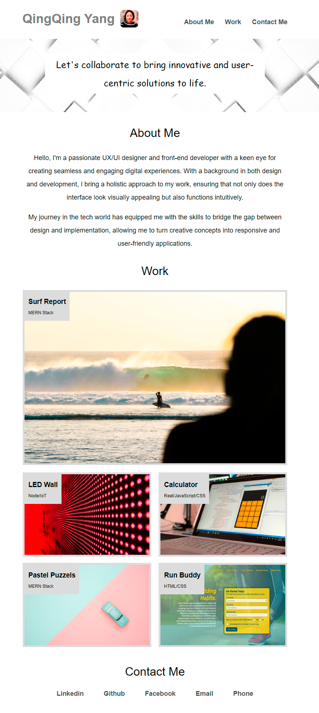
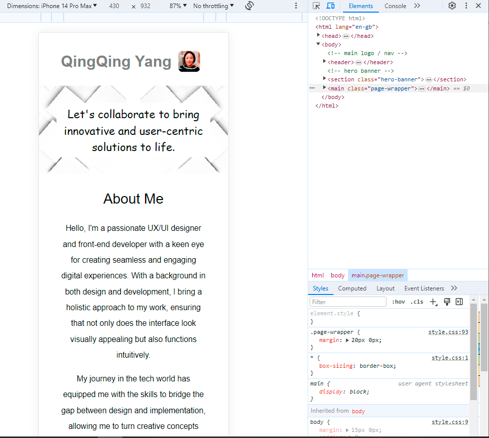

# css-portfolio
CSS Module Challenge Assignment

## Description 

This css-portfolio was created for bootcamp students who were taking the second week's challenge. In this challenge, I need to build a portfolio page.

The web page must meet the following critical requirements:
* When the page is loaded the page presents your name, a recent photo or avatar, and links to sections about you, your work, and how to contact you
* When one of the links in the navigation is clicked then the UI scrolls to the corresponding section
* When viewing the section about your work then the section contains titled images of your applications
* When presented with the your first application then that application's image should be larger in size than the others
* When images of the applications are clicked then the user is taken to that deployed application
* When the page is resized or viewed on various screens and devices then the layout is responsive and adapts to my viewport

## Installation

N/A

## Usage 

To use this css-portfolio,  you can review each file. 
To check whether my portfolio page meets critical requirements, open the webpage [link](https://qingh2o.github.io/css-portfolio/). 
Once the portfolio web page loads, click on all links and images to test if they work properly. 

The page should look similar to the screenshot below.

To test if the page layout is responsive, open Chrome DevTools by right-clicking the page and selecting "Inspect". An Elements panel should open either below or to the side of the webpage in the browser. Click the Toggle device toolbar to see each layout, or click on each element, you will see all styles and positions for each element on the Styles panel. 

The "Inspect" page should look similar to the screenshot below.

## Credits

N/A

## License

Please refer to the LICENSE in the repo.
